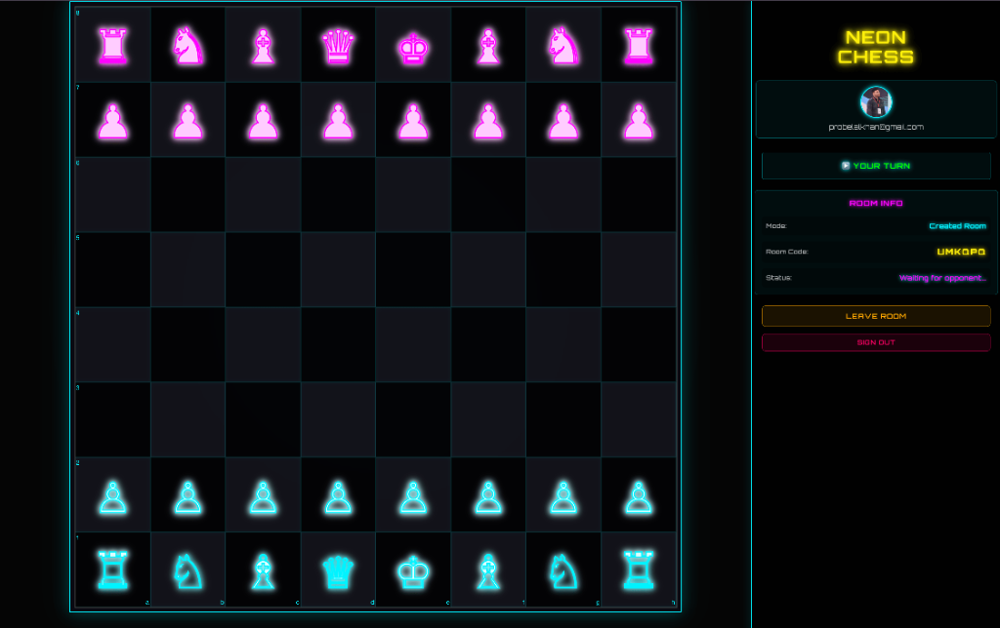

# ♟️ Neon Chess

<div align="center">



**A real-time multiplayer chess game with a stunning cyberpunk neon aesthetic**

[](https://firebase.google.com/)
[](https://vitejs.dev/)
[](https://developer.mozilla.org/en-US/docs/Web/JavaScript)

[Live Demo](https://neon-chess-6758e.web.app) • [Report Bug](https://github.com/probelalkhan/neon-chess/issues) • [Request Feature](https://github.com/probelalkhan/neon-chess/issues)

</div>

---

## ✨ Features

### 🎮 Gameplay
- **Real-time Multiplayer** - Play chess with friends or random opponents online
- **Multiple Game Modes**:
  - 🎲 Random Matchmaking - Get paired with an online player
  - ➕ Create Room - Generate a unique room code to share with friends
  - 🔗 Join Room - Enter a room code to join a friend's game
- **Full Chess Rules** - Complete implementation with move validation, check, and checkmate detection
- **Turn-based System** - Real-time synchronization ensures smooth gameplay

### 🎨 Design
- **Neon Aesthetic** - Stunning cyberpunk-themed UI with glowing chess pieces
- **Custom SVG Pieces** - Beautiful neon-rendered chess pieces with glow effects
- **Responsive Design** - Optimized for both desktop and mobile devices
- **Smooth Animations** - Fluid piece movements and transitions

### 🎵 Audio & Visual Effects
- **Sound Effects** - Distinct sounds for moves, captures, and invalid moves
- **Victory Celebration** - Confetti animation and fanfare sound on game completion
- **Winner Overlay** - Elegant game-over screen with player information

### 🔐 Authentication & Security
- **Google Sign-In** - Secure authentication via Firebase Auth
- **Firebase Security Rules** - Protected database with user-specific access controls
- **Real-time Sync** - Instant game state updates across all connected clients

---

## 🚀 Tech Stack

| Technology | Purpose |
|------------|---------|
| **Vite** | Build tool and dev server |
| **Vanilla JavaScript** | Core application logic |
| **Firebase Auth** | User authentication |
| **Firebase Realtime Database** | Real-time game state synchronization |
| **Firebase Hosting** | Production deployment |
| **chess.js** | Chess game logic and move validation |
| **chessboard.js** | Interactive chessboard rendering |
| **GitHub Actions** | CI/CD pipeline |

---

## 📦 Installation

### Prerequisites
- Node.js 18+ and npm
- Firebase account
- Git

### Setup

1. **Clone the repository**
   ```bash
   git clone https://github.com/probelalkhan/neon-chess.git
   cd neon-chess
   ```

2. **Install dependencies**
   ```bash
   npm install
   ```

3. **Configure Firebase**
   - Create a Firebase project at [Firebase Console](https://console.firebase.google.com/)
   - Enable Google Authentication
   - Enable Realtime Database
   - Copy your Firebase config to `src/firebase.js`

4. **Set up Firebase Security Rules**
   - Go to Realtime Database → Rules
   - Copy the rules from `FIREBASE_RULES.md` (if available) or set up appropriate security rules

5. **Run development server**
   ```bash
   npm run dev
   ```

6. **Build for production**
   ```bash
   npm run build
   ```

---

## 🎯 How to Play

1. **Sign In** - Use your Google account to authenticate
2. **Choose Game Mode**:
   - **Random Match** - Click "Find Match" to be paired with an online player
   - **Create Room** - Generate a room code and share it with a friend
   - **Join Room** - Enter a friend's room code to join their game
3. **Play Chess** - Make moves by dragging and dropping pieces
4. **Win the Game** - Checkmate your opponent to win!

### Controls
- **Drag & Drop** - Move pieces by dragging them to valid squares
- **ESC Key** - Cancel piece selection
- **Click** - Select a different piece to cancel current selection

---

## 🏗️ Project Structure

```
neon-chess/
├── src/
│   ├── app.js              # Main application entry point
│   ├── auth.js             # Firebase authentication logic
│   ├── db.js               # Firebase Realtime Database operations
│   ├── firebase.js         # Firebase configuration
│   ├── game.js             # Chess game logic and rendering
│   ├── gameOver.js         # Game completion overlay and confetti
│   ├── gameTemplate.js     # Game page HTML template
│   ├── gameTypeSelection.js # Game mode selection logic
│   ├── login.js            # Login page logic
│   ├── room.js             # Room management utilities
│   └── *.css               # Component styles
├── .github/
│   └── workflows/
│       └── firebase-hosting.yml  # CI/CD pipeline
├── firebase.json           # Firebase Hosting configuration
├── .firebaserc             # Firebase project configuration
└── package.json            # Dependencies and scripts
```

---

## 🚀 Deployment

This project uses **GitHub Actions** for automatic deployment to Firebase Hosting.

### Automatic Deployment
Every push to the `main` branch triggers:
1. Build process (`npm run build`)
2. Automatic deployment to Firebase Hosting

### Manual Deployment
```bash
# Build the project
npm run build

# Deploy to Firebase
firebase deploy --only hosting
```

---

## 🤝 Contributing

Contributions are welcome! Please feel free to submit a Pull Request.

1. Fork the project
2. Create your feature branch (`git checkout -b feature/AmazingFeature`)
3. Commit your changes (`git commit -m 'Add some AmazingFeature'`)
4. Push to the branch (`git push origin feature/AmazingFeature`)
5. Open a Pull Request

---

## 📝 License

This project is open source and available under the [MIT License](LICENSE).

---

## 👨‍💻 Author

**Belal Khan**
- GitHub: [@probelalkhan](https://github.com/probelalkhan)
- Email: probelalkhan@gmail.com

---

## 🙏 Acknowledgments

- [chess.js](https://github.com/jhlywa/chess.js) - Chess game logic
- [chessboard.js](https://chessboardjs.com/) - Interactive chessboard
- [Firebase](https://firebase.google.com/) - Backend services
- [Vite](https://vitejs.dev/) - Build tool

---

<div align="center">

**Made with ❤️ and ☕**

If you found this project helpful, please consider giving it a ⭐!

</div>
